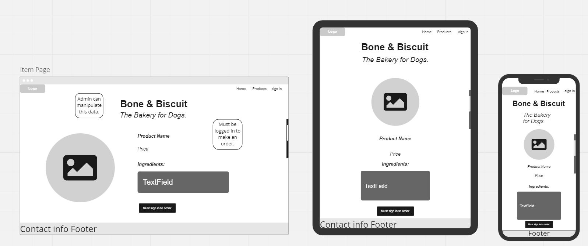
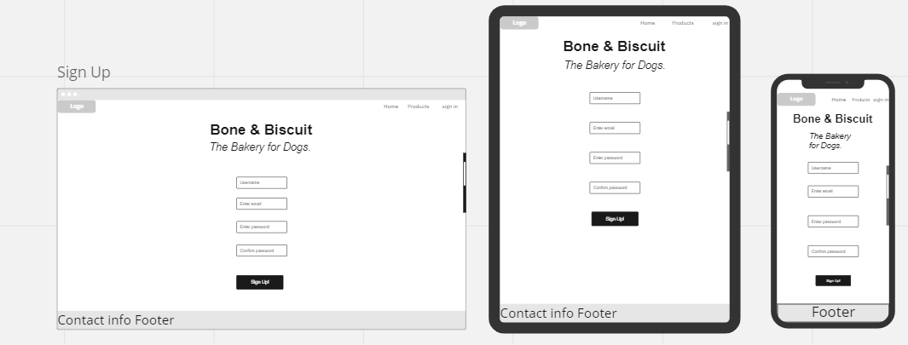

# <b> T3A2-A • Bone & Biscuit </b>
Developer Team: PJ & Lily Noël

## R1. Description
Bone & Biscuit is an online store for a local canine bakery specializing in baked biscuits and treats for dogs. 

#### Purpose
- The purpose of this application is to provide a service for dog owners to both seek out and place an order for artisan dog treats. 

<!-- 

#### Functionality / Features
- User sign up / login 
- Create a new review
- Select a star rating 
- Edit & destroy own ratings  
  
- -->

#### Target audience 
- This application is geared towards consumers looking to place an online order of artisan dog treats which they can then pickup at the store's physical location. 

<!-- #### Tech Stack -->

<!-- 
## R2. Dataflow Diagram 

## R3. Application Architecture Diagram

## R4. User Stories -->

## R5. Wireframes for multiple standard screen sizes, created using industry standard software

#### Home screen logged in.

#### Home screen logged out.

#### Product page logged in.

#### Product page logged out.

#### Sign in page.

#### Sign up page.

<!-- ## R6 Screenshots of your Trello board throughout the duration of your project  -->

<!--  -->
