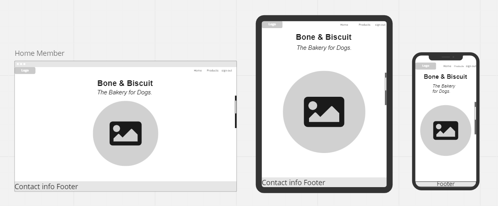
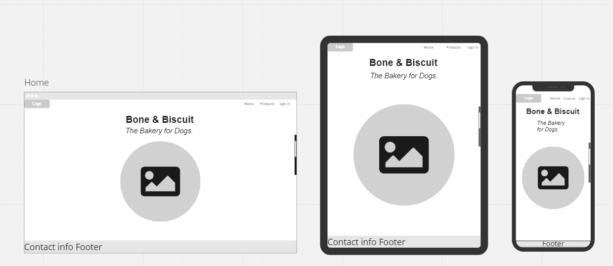
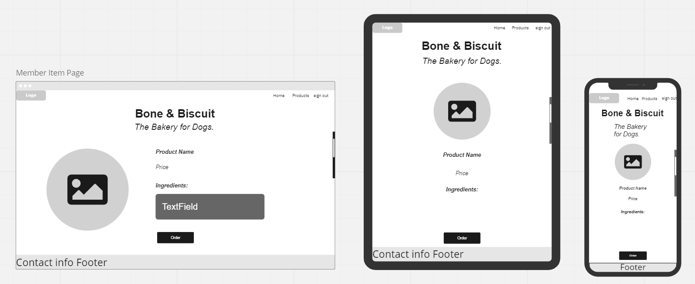
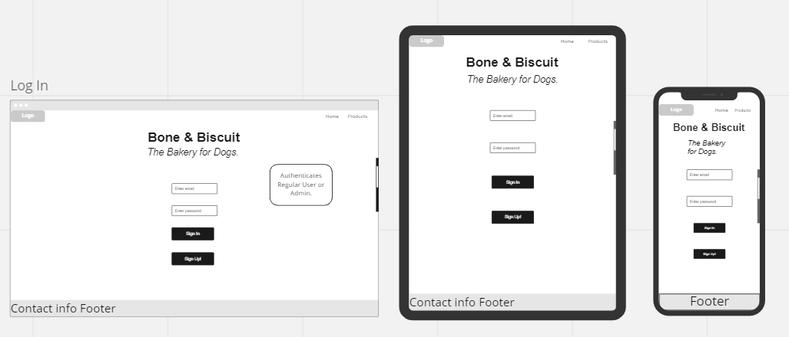

# T3A2-A • Full Stack App (Part A)

### Application Name
Bone & Biscuit

### Developer Team
PJ & Lily Noël

## R1. Description
Bone & Biscuit is an online store for a local canine bakery specializing in baked biscuits and treats for dogs. 

#### Purpose
- The purpose of this application is to provide a service for dog owners to both seek out and place an order for artisan dog treats. 

<!-- 

#### Functionality / Features
- User sign up / login 
- Create a new review
- Select a star rating 
- Edit & destroy own ratings  
  
- -->

#### Target audience 
- This application is geared towards consumers looking to place an online order of artisan dog treats which they can then pickup at the store's physical location. 

#### Tech Stack
This application was built using Rails 7.0.4.2, Ruby 3.1.1, React.js, JavaScript, HTML & CSS. The database used is PostgresQL and the app was deployed with Heroku. Images were hosted using Wix & ImgBB. <!-- may need to be updated closer to deployment -->

<!-- 
## R2. Dataflow Diagram 

## R3. Application Architecture Diagram -->

## R4. User Stories 
In the context of this application, users will be categorized into "Admin user", "Guest users" and "Members".

#### Admin user
The goal of an admin user is to update available products and quantities.

- As an admin user, its important that I can post, edit, delete and view my listings and that no one else can access those features on my product listings beyond viewing and ordering. 
 

- As an admin user it is important that this application offers the capabilities for me to update and adjust quantities as I replenish my stock of baked goods and to ensure that stock numbers are accurate + the ability to make changes to stock numbers where necessary. 

#### Guest users
The goal of a guest user is to view the menu of available baked goods and their corresponding prices and to locate address and contact information for Bone & Biscuit's storefront. 
 

- As a guest or visitor to the Bone & Biscuit web application, I'd like to have the option of navigating the site seamlessly, have an understanding of what the application does / it's purpose and experience some of the app's features such as viewing a listing. 
 

- The option to sign up / register is important as a guest or visitor to the application. If I enjoy my preliminary experience of the application, and it aligns with my needs I will then expect the capability of registering to the application's services to place an order. 
  
#### Members
The goal of a member in addition to the guest user goals, is to place an online order of freshly baked treats for my dog that I can conveniently collect at the Bone & Biscuit bakery location.
 

- As a member you have the ability to access the website in its full state as a guest user except with the ability to reserve baked goods for pickup.  

## R5. Wireframes

<h4 align="center">

Home screen | Signed in  

#### Home screen | Guest user  
.

#### Product page | Signed in.  

Product page | Guest user  

#### Sign in page.  

#### Sign up page.  

</h4>

<!-- ## R6 Screenshots of your Trello board throughout the duration of your project  -->

#

<!-- ## R6 Screenshots of your Trello board throughout the duration of your project  -->

<!--  -->
